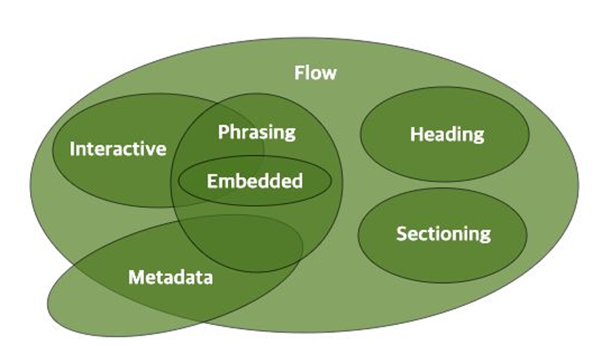

## Living Standard (Since 2019)

>[whatwg.org](https://html.spec.whatwg.org/)
HTML을 유지하고 발전시키는 커뮤니티. 
브라우저 제조사(구글, 애플, 마이크로소프트, 모질라) 연합. 
HTML 표준은 탈 권위적이고 살아있는 것이 됨(버전이 사라짐). 
W3C HTML 명세는 대체(폐기)됨.

## Implemented Standard (구현된 표준)

>[cnaiuse](https://caniuse.com)
웹 표준 명세의 브라우저 구현 현황을 확인. 
공식 표준이라도 브라우저 제조사가 구현하지 않으면 의미 없음.

## 주요 HTML 콘텐츠 분류

>[HTML Standard](https://html.spec.whatwg.org/multipage/indices.html#element-content-categories)

| 카테고리                                                                                     | 요소                                                                                                                                                                                                                                                                                                                                                                                                                                                                                                                                                                                                               | 설명                                                                                               |
| :--------------------------------------------------------------------------------------- | :--------------------------------------------------------------------------------------------------------------------------------------------------------------------------------------------------------------------------------------------------------------------------------------------------------------------------------------------------------------------------------------------------------------------------------------------------------------------------------------------------------------------------------------------------------------------------------------------------------------- | :----------------------------------------------------------------------------------------------- |
| Flow Content (플로우 콘텐츠)                                                                | a, abbr, address, area, map, article, aside, audio, b, bdi, bdo, blockquote, br, button, canvas,  cite, code, data, datalist, del, details, dfn, dialog, div, dl, em, embed, fieldset, figure, footer, form,  h1, h2, h3, h4, h5, h6, header, hgroup, hr, i, iframe, img, input, ins, kbd, label, link, main, map, mark,  math, menu, meta, meter, nav, noscript, object, ol, output, p, picture, pre, progress, q, ruby, s, samp,  script, section, select, slot, small, span, strong, sub, sup, svg, table, template, textarea, time, u, ul, var,  video, wbr, autonomous custom elements, text | body 에 포함할 수 있는 모든 요소. base, style, title 요소를 제외한 나머지 모든 요소.                               |
| Metadata content  (메타데이터 콘텐츠)  *display: none;*                                 | base, ==link==, ==meta==, ==noscript==, ==script==, style, ==template==, title                                                                                                                                                                                                                                                                                                                                                                                                                                                                                                                                   | ==일부== 요소는 경우에 따라 플로우 콘텐츠.                                                                       |
| Heading content (헤딩 콘텐츠)  *display: block;*                                     | h1, h2, h3, h4, h5, h6, hgroup                                                                                                                                                                                                                                                                                                                                                                                                                                                                                                                                                                                   | 섹셔닝 콘텐츠가 없어도 헤딩 콘텐츠가 있으면 암시적으로 섹션(문서의 개요)이 형성된다.                                           |
| Sectioning content (섹셔닝 콘텐츠)  *display: block;*                                 | article, aside, nav, section                                                                                                                                                                                                                                                                                                                                                                                                                                                                                                                                                                                     | 문서의 개요를 형성. 헤딩, 헤더, 풋터의 범위. 각 섹셔닝 콘텐츠는 암시적인 개요를 형성.  섹셔닝 콘텐츠와 헤딩 콘텐츠를 함께 사용하면 명시적인 개요를 형성. |
| Phrasing content (프레이징 콘텐츠)  *display: inline \|  inline-block \| ==none==;* | a, abbr, area, audio, b, bdi, bdo, br, button, canvas, cite, code, data, datalist, del, dfn, em, embed, i, iframe,  img, input, ins, kbd, label, ==link==, map, mark, math, ==meta==, meter, ==noscript==, object, output, picture, progress,  q, ruby, s, samp, ==script==, select, slot, small, span, strong, sub, sup, svg, ==template==, textarea, time, u, var, video,  wbr, autonomous custom elements, text                                                                                                                                                                                      | 구문 콘텐츠. 단락을 형성하는 콘텐츠.                                                                            |
| Embedded content (임베디드 콘텐츠)  *display: inline \|  inline-block;*             | audio, canvas, embed, iframe, img, math, object, picture, svg, video                                                                                                                                                                                                                                                                                                                                                                                                                                                                                                                                             | 모든 임베디드 콘텐츠는 구문 콘텐츠이다.  외부 자원을 지원하지 않는 경우 대체 자원을 명시할 수 있다.                                 |
| Interactive content (인터렉티브 콘텐츠)  *display: inline \|  inline-block;*         | a, audio, button, details, embed, iframe, img, input, label, select, textarea, video                                                                                                                                                                                                                                                                                                                                                                                                                                                                                                                             | 사용자와 상호 작용할 수 있는 콘텐츠. 입력 장치(키보드, 마우스)로 조작할 수 있다.                                              |
| Palpable content (팰퍼블 콘텐츠)                                                            | a, abbr, address, article, aside, audio, b, bdi, bdo, blockquote, button , canvas, cite, code, data, details, dfn, div,  dl, em, embed, fieldset, figure, footer, form, h1, h2, h3, h4, h5, h6, header, hgroup, i, iframe, img, input,  ins, dbd, label, main, map, mark, math, menu, meter, nav, object, ol, output, p, pre, progress, g, ruby,  s, samp, section, select, small, span, strong, sub, sup, svg, table, textarea, time, u, ul, var, video,  autonomous custom elements, text that is not inter-element whitespace                                                                     | 비어 있지 않은, 볼 수 있는 콘텐츠. hidden 속성이 없는.                                                             |
| Script-supporting element (스크립트 지원 요소)                                                | script, template                                                                                                                                                                                                                                                                                                                                                                                                                                                                                                                                                                                                 | 렌더링하지 않지만 사용자에게 기능을 제공                                                                           |
| Transparent content models  (투명 콘텐츠 모델)                                               | a, ins, del, object, video, audio, map, noscript, canvas                                                                                                                                                                                                                                                                                                                                                                                                                                                                                                                                                         | 투명 콘텐츠 모델. 부모의 콘텐츠 모델을 따른다. 투명한 요소를 제거해도 부모와 자식 관계가 문법적으로 유효해야 한다.                            |

### Summary

1. Living standard (whatwg)
2. Implemented standard (cnaiuse)
3. Element (tag name)
4. Category
5. Context (부모 요소의 콘텐츠 모델 유추 가능)
6. Content modal (자식 요소의 카테고리)
7. Transparent content modal

### 과제

>과제 - https://t.ly/aJWB 
>과제 해설 - https://t.ly/Wj1z