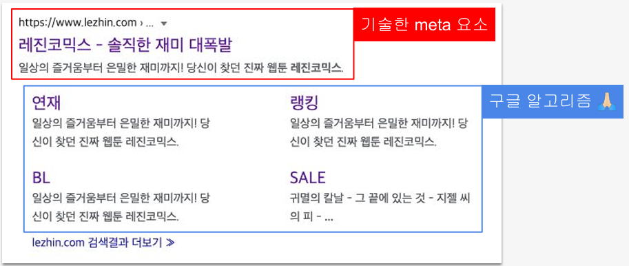
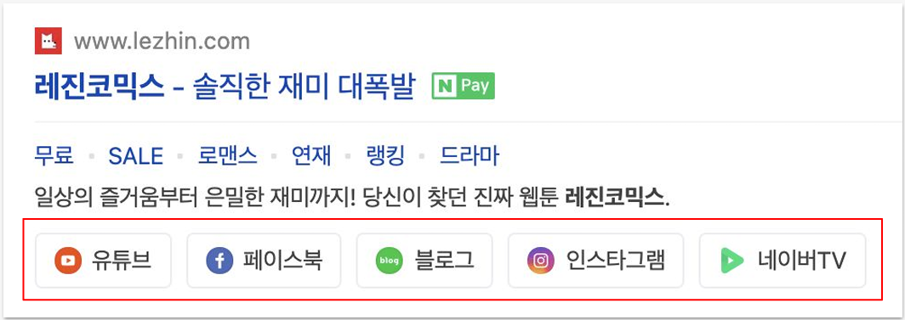

## SEO에 영향을 주는 요인들
- 검색 결과 페이지 (SERP) 노출 대비 클릭률 
- 백링크(backlink): 다른 웹 페이지로부터 인용(링크)되는 횟수. 
- 도메인 권력(Domain authority): 검색 결과 페이지 순위 예측 점수. 
- 페이지 타이틀 
- 메타 디스크립션 
 - 로딩 속도 
 - SSL(https) 사용 여부 
- 콘텐츠의 양, 질, 개연성 
- 사용자 경험 : LCP( 최대 콘텐츠 블럭 그리기 ), CLS( 누적 배치 변경)

## 페이지 타이틀 구분자
==대시(-), 파이프(|), 클론(:)을 추천.==
- Page title - Site name 
- Page title | Site name 
- Page title : Site name
>대시(-)를 사용하면 키워드 사이의 공간이 더 크기 때문에 가독성이 좋다. 
>파이프(|), 콜론(:)은 장평이 적기 때문에 공간을 더 효율적으로 사용할 수 있다. 
>언더바(_)는 인접 키워드를 하나로 연결하기 때문에 추천하지 않는다.

### SEO - Summary
1. 본문을 가장 잘 설명하는 키워드 중심으로. 
2. 페이지마다 구체적이고 고유한(흔하지 않은) 키워드를 사용. 
3. 페이지마다 반복하는 키워드 최소화. 
4. 구체적인 키워드를 앞으로 배치. 
5. 가능한 짧게.

## Metadata - html, head
```html
<html lang="ko"> // google에서 신뢰 하지 않음. 기존 사이트가 "en" 값이 많기 때문..접근성에는 중요
<head>
	<meta charset="utf-8"> // 표준
	<meta name="description" content="A description of the page"> // 검색 화면에 표출
	<meta name="keywords" content="webtoon, aduit, free, coupon, ..."> // google 검색엔진에서 keywords는 신뢰 하지 않음: page의 속성에 따라 keywords가 맞지 않은 사이트가 더 많기 때문...
	<meta name="viewport" content="width=device-width, inital-scale=1"> // 모바일에서 볼 수 있는지...
	<title>Page title - Site name</title> // 최대 3depth가 좋고, "-" 가독성이 좋다.
</head>

```
>>[Google에서는 웹 순위에서 키워드 메타 태그를 사용하지 않습니다  |  Google 검색 센터 블로그  |  Google for Developers](https://developers.google.com/search/blog/2009/09/google-does-not-use-keywords-meta-tag?hl=ko)

### google meta 설정


>[Google에서 지원하는 메타 태그 및 속성 | Google 검색 센터  |  문서  |  Google for Developers](https://developers.google.com/search/docs/crawling-indexing/special-tags?hl=ko)
>[사이트링크에 대해 자세히 알아보기 | Google 검색 센터  |  문서  |  Google for Developers](https://developers.google.com/search/docs/appearance/sitelinks?hl=ko&visit_id=638760537439549603-1415195570&rd=1)

### 네이버 연관 채널

>[사이트 연관채널 - 네이버 서치어드바이저](https://searchadvisor.naver.com/guide/structured-data-channel)
>[Getting Started - schema.org](https://schema.org/docs/gs.html)

### 페이스북
```html
<meta property="og:url"                content="https://*.html">
<meta property="og:title"              content="...">
<meta property="og:description"        content="...">
<meta property="og:image"              content="https://*.jpg">
```
>[웹 마스터 - 공유](https://developers.facebook.com/docs/sharing/webmasters#markup)
>[공유 디버거 - Meta for Developers](https://developers.facebook.com/tools/debug/)

### 트위터
```html
<meta name="twitter:card"               content="summary">
<meta name="twitter:title"              content="...">
<meta name="twitter:description"        content="...">
<meta name="twitter:image"              content="https://*.jpg">
```
>[Cards markup | Docs | Twitter Developer Platform](https://developer.x.com/en/docs/x-for-websites/cards/overview/markup)
>https://cards-dev.x.com/validator

### Meta - Summary
```html
<html lang="ko">
	<head>
		 // google
		 <meta charset="utf-8">
		 <meta name="description" content="A description of the page">
		 <meta name="viewport" content="width=device-width, initial-scale=1">
		 <title>Page title - Site name</title>
		 // facebook
		 <meta property="og:url" content="https://*.html">
		 <meta property="og:title" content="...">
		 <meta property="og:description" content="...">
		 <meta property="og:image" content="https://*.jpg">
		 // twitter
		 <meta name="twitter:card" content="summary">
		 <meta name="twitter:title" content="...">
		 <meta name="twitter:description" content="...">
		 <meta name="twitter:image" content="https://*.jpg">
	</head>
	<body>
		...
		<script type="application/ld+json">{...}</script> // naver
	</body>
</html>
```

### 과제
>과제 - https://t.ly/aJWB 
>과제 해설 - https://t.ly/Wj1z